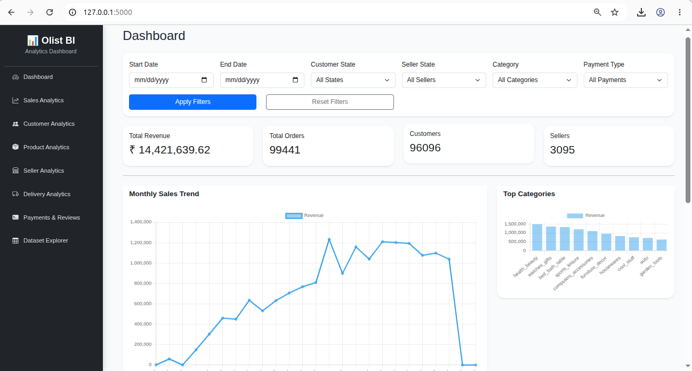
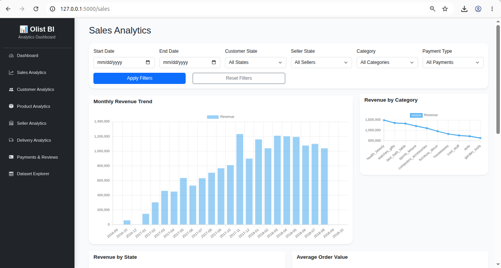
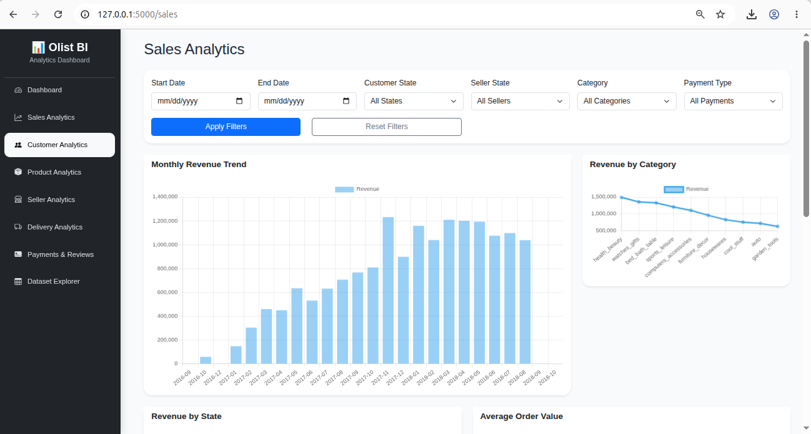
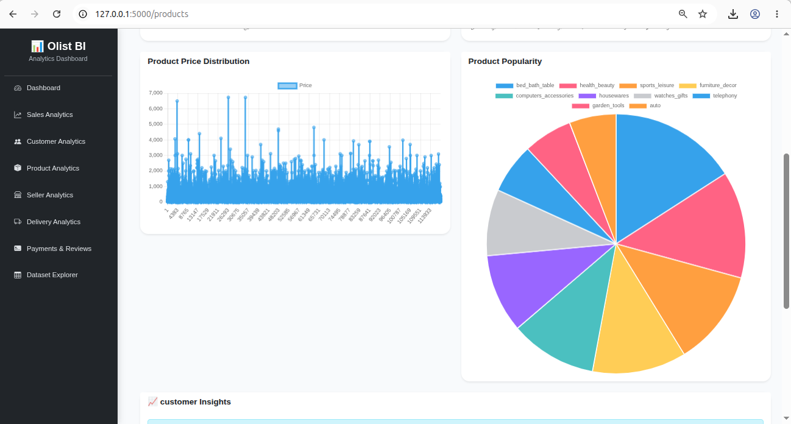
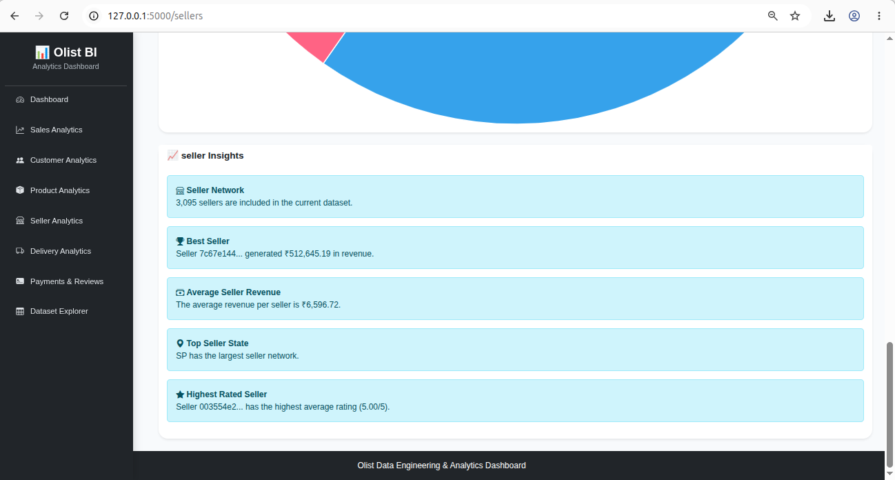
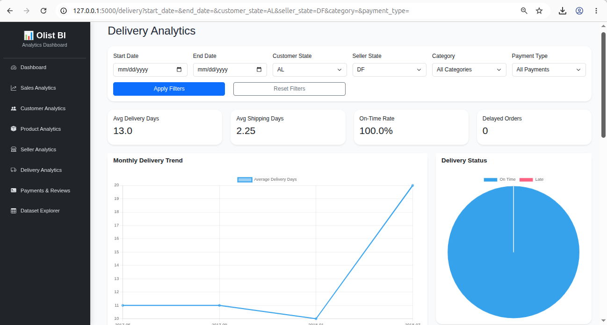
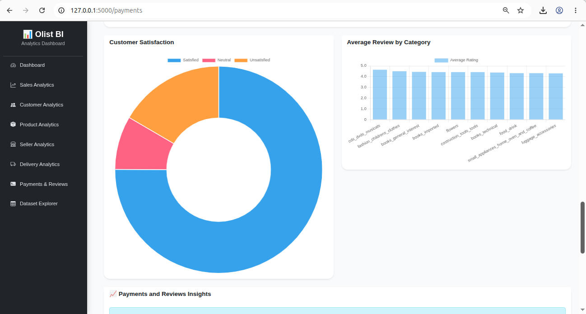
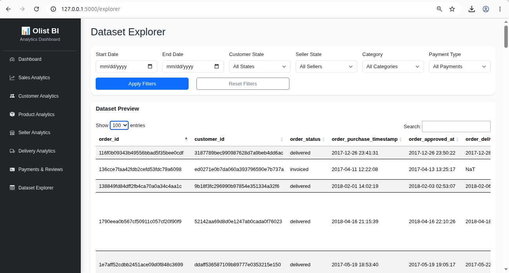

# 🇧🇷 Brazilian E-Commerce Analytics Dashboard

A comprehensive Business Intelligence (BI) dashboard built using **Flask**, **Pandas**, **Chart.js**, and **Bootstrap** to analyze the Brazilian Olist E-Commerce dataset.

The project transforms raw e-commerce data into interactive dashboards that help stakeholders understand sales performance, customer behavior, product trends, seller performance, delivery efficiency, payment preferences, and customer reviews.

---

# Project Overview

The objective of this project is to simulate a real-world Business Intelligence solution by performing:

- Data Cleaning
- Data Quality Assessment
- Feature Engineering
- Exploratory Data Analysis
- Business KPI Generation
- Interactive Data Visualization
- Business Insights Generation
- Dataset Exploration

The dashboard enables users to filter data dynamically and instantly view updated KPIs, charts, and business insights.

---

# Features

## Executive Dashboard

- Total Revenue
- Total Orders
- Total Customers
- Total Sellers
- Monthly Revenue Trend
- Revenue by Product Category
- Executive Business Insights

---

## Sales Analytics

- Revenue Analysis
- Monthly Sales Trend
- State-wise Revenue
- Category-wise Revenue
- Average Order Value
- Interactive Filters
- Automated Sales Insights

---

## Customer Analytics

- Customer Distribution
- Repeat Customer Analysis
- Customer Lifetime Value
- Purchase Frequency
- Customer Spending
- Automated Customer Insights

---

## Product Analytics

- Product Categories
- Best Selling Products
- Product Popularity
- Product Price Distribution
- Category Revenue
- Product Performance Insights

---

## Seller Analytics

- Seller Performance
- Seller Revenue
- Average Seller Rating
- Orders per Seller
- Seller State Analysis
- Best Seller Identification
- Seller Insights

---

## Delivery Analytics

- Delivery Time Analysis
- Shipping Performance
- Delivery Status
- Fastest Sellers
- State-wise Delivery Performance
- Delivery Trend
- Delivery Insights

---

## Payment Analytics

- Payment Method Distribution
- Installment Analysis
- Payment KPIs
- Payment Insights

---

## Customer Review Analytics

- Review Distribution
- Monthly Review Trend
- Customer Satisfaction
- Review by Product Category
- Sentiment Analysis
- Review Insights

---

## Dataset Explorer

- Interactive Dataset Preview
- Search Records
- Pagination
- Dataset Overview
- Data Quality Summary
- Dataset Insights
- Export Ready

---

# Dashboard Modules

```
Dashboard

├── Executive Dashboard

├── Sales Analytics

├── Customer Analytics

├── Product Analytics

├── Seller Analytics

├── Delivery Analytics

├── Payment Analytics

├── Customer Review Analytics

└── Dataset Explorer
```

---

# Technology Stack

## Backend

- Python
- Flask
- Pandas
- NumPy

## Frontend

- HTML5
- CSS3
- Bootstrap 5
- JavaScript
- Chart.js

## Data Processing

- Pandas
- NumPy

## Visualization

- Chart.js

---

# Project Structure

```
olist_dashboard/

│

├── app.py

│

├── data/
│
├── notebooks/
│
├── static/
│   ├── css/
│   ├── js/
│   └── images/
│
├── templates/
│   ├── components/
│   ├── dashboard.html
│   ├── sales.html
│   ├── customers.html
│   ├── products.html
│   ├── sellers.html
│   ├── delivery.html
│   ├── payments.html
│   └── explorer.html
│
├── utils/
│   ├── analytics.py
│   ├── insights.py
│   ├── filters.py
│   └── data_loader.py
│
├── README.md
│
└── requirements.txt
```

---

# Dataset

This project uses the **Brazilian Olist E-Commerce Public Dataset**.

The dataset contains information about:

- Customers
- Orders
- Payments
- Products
- Sellers
- Reviews
- Delivery
- Geolocation

After preprocessing, the project combines multiple datasets into a single master dataset for analytics.

---

# Data Pipeline

```
Raw CSV Files

        │

        ▼

Data Cleaning

        │

        ▼

Data Quality Report

        │

        ▼

Feature Engineering

        │

        ▼

Master Dataset

        │

        ▼

Analytics Functions

        │

        ▼

KPIs

Charts

Insights

        │

        ▼

Flask Dashboard
```

---

# Key Performance Indicators (KPIs)

The dashboard calculates various business KPIs including:

### Dashboard

- Total Revenue
- Total Orders
- Total Customers
- Total Sellers

### Sales

- Revenue
- Orders
- Average Order Value
- Revenue by Category

### Customers

- Customer Count
- Repeat Customers
- Customer Lifetime Value
- Average Spending

### Products

- Product Count
- Category Count
- Best Category
- Average Price

### Sellers

- Total Sellers
- Best Seller
- Seller Rating
- Average Orders

### Delivery

- Delivery Time
- Shipping Time
- Delayed Orders
- On-Time Delivery Rate

### Payments

- Total Payment
- Average Payment
- Payment Methods
- Installment Analysis

### Reviews

- Average Rating
- Satisfaction Score
- Positive Reviews
- Review Distribution

---

# Interactive Features

- Dynamic Filtering
- Real-Time KPI Updates
- Interactive Charts
- Business Insight Cards
- Responsive Design
- Dataset Explorer
- Searchable Tables

---

# Business Insights

The dashboard automatically generates insights such as:

- Highest Revenue State
- Best Selling Product Category
- Top Performing Seller
- Fastest Delivery Region
- Customer Satisfaction Trends
- Payment Method Trends
- Review Performance
- Delivery Efficiency
- Revenue Growth

---

# Installation

## Clone Repository

```bash
git clone https://github.com/yourusername/Brazilian_Ecommerce_Analytics.git
```

---

## Move to Project

```bash
cd Brazilian_Ecommerce_Analytics
```

---

## Install Dependencies

```bash
pip install -r requirements.txt
```

---

## Run Flask

```bash
python app.py
```

---

## Open Browser

```
http://127.0.0.1:5000
```

---

# Future Enhancements

- User Authentication
- Dashboard Export to PDF
- Excel Report Generation
- Forecasting using Machine Learning
- Customer Segmentation
- Recommendation System
- Real-Time Analytics
- Cloud Deployment
- Docker Support
- REST API
- Power BI Integration

---

# Learning Outcomes

This project demonstrates practical experience in:

- Data Cleaning
- Data Wrangling
- Data Quality Assessment
- Feature Engineering
- Business Intelligence
- Dashboard Development
- Data Visualization
- Business Analytics
- Flask Web Development
- Interactive Reporting
- Python Programming
- Pandas
- Chart.js
- Bootstrap
- Analytical Thinking

---

# Screenshots

Add screenshots of:

##  Executive Dashboard



---

## Sales Analytics



---

## Customer Analytics



---

## Product Analytics



---
## Seller Analytics



---

## Delivery Analytics



---

## Payment Analytics



---


## Dataset Explorer



---

# Author

**Logesh**


---

# License

This project is developed for educational and portfolio purposes.