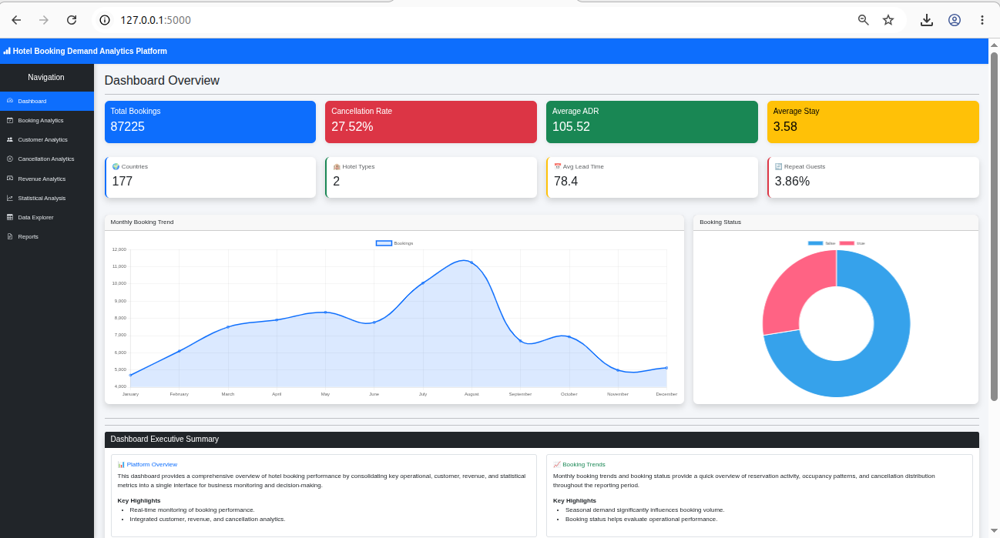
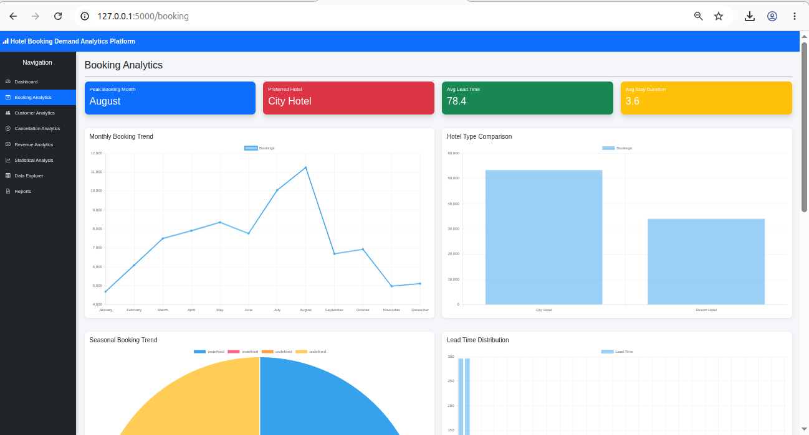
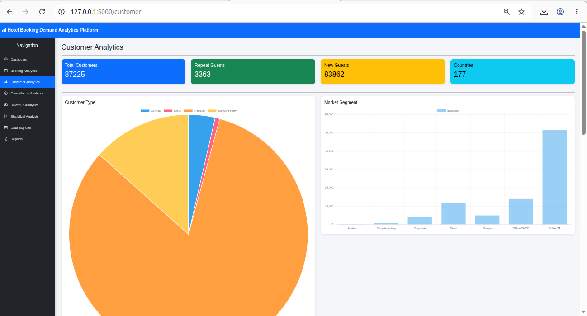
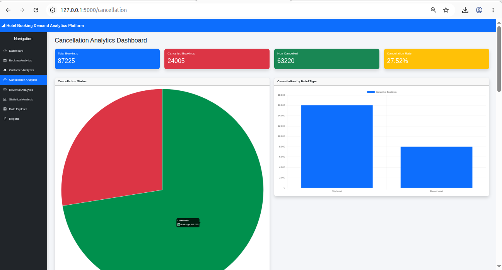
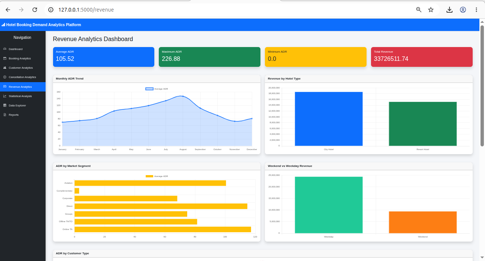
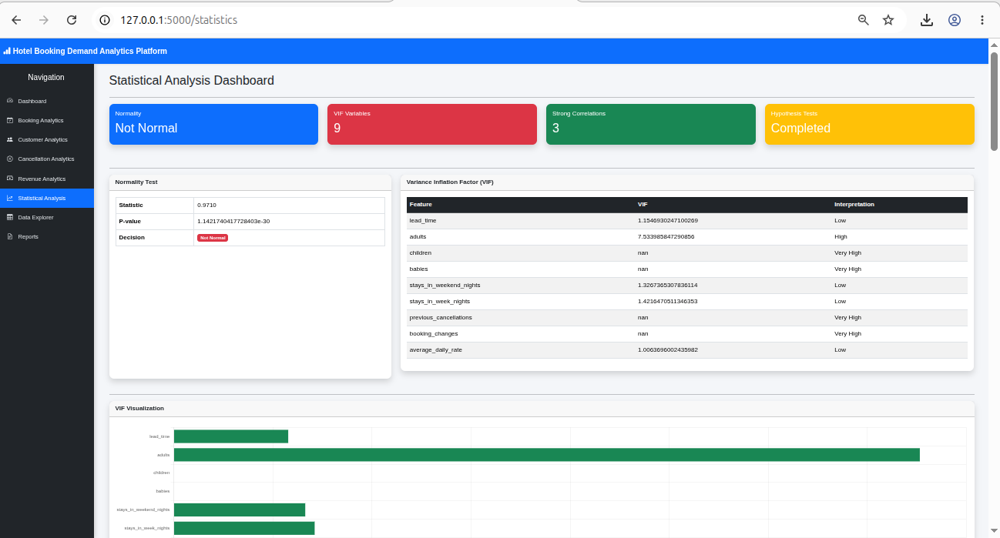
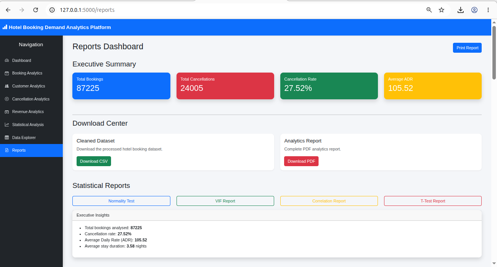
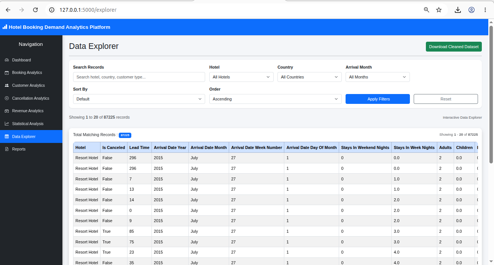

# 🏨 Hotel Booking Demand Analytics Platform

A comprehensive **Data Analytics & Business Intelligence Platform** developed using **Python, Flask, Pandas, NumPy, SciPy, Statsmodels, Bootstrap, Chart.js, and SQLite** to analyze hotel booking demand patterns. The project performs data preprocessing, exploratory data analysis (EDA), statistical analysis, and interactive dashboard visualization to support data-driven business decision-making.

---

## 📖 Project Overview

The Hotel Booking Demand Analytics Platform provides an end-to-end analytics solution for hotel booking data. The application processes raw booking records, performs statistical validation, generates business insights, and presents the results through interactive dashboards and downloadable reports.

The platform covers:

- Data Cleaning & Preprocessing
- Exploratory Data Analysis (EDA)
- Statistical Analysis
- Interactive Business Dashboards
- Data Explorer
- Report Generation
- Dataset Downloads

---

## 🚀 Features

### 📊 Dashboard Overview
- Executive KPI Cards
- Monthly Booking Trend
- Booking Status Distribution
- Executive Highlights
- Business Summary

### 📅 Booking Analytics
- Monthly Booking Trend
- Hotel Type Comparison
- Seasonal Booking Trend
- Lead Time Distribution
- Booking Insights

### 👥 Customer Analytics
- Customer Type Distribution
- Market Segment Analysis
- Top Customer Countries
- Repeat Guest Analysis
- Customer Insights

### ❌ Cancellation Analytics
- Cancellation Status
- Hotel-wise Cancellations
- Market Segment Analysis
- Deposit Type Analysis
- Lead Time Comparison
- Cancellation Summary

### 💰 Revenue Analytics
- Monthly ADR Trend
- Revenue by Hotel Type
- ADR by Market Segment
- Weekend vs Weekday Revenue
- Customer Revenue Analysis
- Revenue Insights

### 📈 Statistical Analysis
- Normality Test
- Variance Inflation Factor (VIF)
- Correlation Analysis
- Independent t-Test
- Chi-Square Test
- Statistical Interpretation

### 🔍 Data Explorer
- Search Records
- Hotel Filter
- Country Filter
- Month Filter
- Sorting
- Pagination
- Download Processed Dataset

### 📄 Reports
- Download Analytics Report (PDF)
- Download EDA Report
- Download Processed Dataset

---

# 🛠️ Technologies Used

| Category | Technologies |
|----------|--------------|
| Programming Language | Python |
| Backend | Flask |
| Frontend | HTML5, CSS3, Bootstrap 5 |
| Visualization | Chart.js |
| Data Analysis | Pandas, NumPy |
| Statistical Analysis | SciPy, Statsmodels |
| Database | SQLite |
| Report Generation | WeasyPrint |
| Version Control | Git & GitHub |

---

# 📂 Project Structure

```text
Hotel_Booking_Demand/
│
├── data/
│   ├── raw/
│   ├── processed/
│
├── notebooks/
│   ├── 01_Data_Understanding.ipynb
│   ├── 02_Data_Cleaning.ipynb
│   ├── 03_EDA.ipynb
│   └── 04_Statistical_Analysis.ipynb
│
├── flask_app/
│   ├── routes/
│   ├── templates/
│   ├── static/
│   │   ├── css/
│   │   ├── js/
│   │   └── images/
│   └── app.py
│
├── reports/
│
├── screenshots/
│
├── requirements.txt
└── README.md
```

---

# 📸 Application Screenshots

## Dashboard Overview



---

## Booking Analytics



---

## Customer Analytics



---

## Cancellation Analytics



---

## Revenue Analytics



---

## Statistical Analysis



---

## Reports



---

## Data Explorer



---

# 📊 Statistical Analysis Performed

The project includes the following statistical techniques:

- Normality Test
- Correlation Analysis
- Variance Inflation Factor (VIF)
- Independent t-Test
- Chi-Square Test
- Business Interpretation of Statistical Results

---

# 📈 Business Insights

The platform provides actionable insights including:

- Seasonal booking trends
- Customer behavior analysis
- Revenue performance evaluation
- Hotel occupancy patterns
- Cancellation trends
- Customer segmentation
- Market segment analysis
- Lead time analysis
- Statistical validation of business assumptions

---

# 📄 Reports Generated

The application supports downloading:

- Hotel Booking Analytics Report (PDF)
- Exploratory Data Analysis (EDA) Report
- Processed Dataset (CSV)

---

# ⚙️ Installation

Clone the repository:

```bash
git clone <repository-url>
```

Navigate to the project folder:

```bash
cd Hotel_Booking_Demand
```

Install dependencies:

```bash
pip install -r requirements.txt
```

Run the application:

```bash
python app.py
```

Open your browser:

```text
http://127.0.0.1:5000
```

---

# 📌 Future Enhancements

- User Authentication
- Predictive Booking Models
- Machine Learning Forecasting
- Interactive Filters
- Advanced PDF Reports
- Export Dashboards to Excel
- Real-Time Analytics

---

# 👨‍💻 Author

**Logesh**

<<<<<<< HEAD
AI & Data Science Developer

=======
>>>>>>> f1480bbecb5f7f086e6cf32ddca18dd327e95e3b
---

# 📃 License

This project is developed for educational and portfolio purposes.